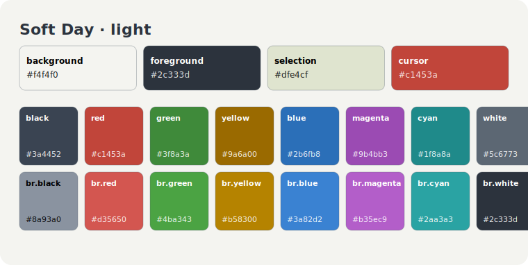
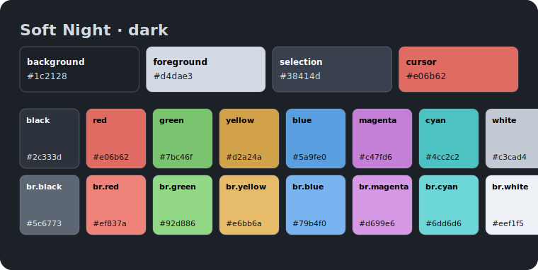

# Soft Themes

High-contrast, easy-on-the-eyes themes built on a shared palette.

- **Soft Day** — light, near-neutral soft-white (`#f4f4f0`) on dark slate (`#2c333d`)
- **Soft Night** — dark, dark slate (`#1c2128`) on soft fog (`#d4dae3`)

Each palette below drives both the Ghostty and VS Code versions of that theme.

```
soft/
  light/   ghostty/  vscode/  soft-day-palette.svg
  dark/    ghostty/  vscode/  soft-night-palette.svg
```

### Soft Day



### Soft Night



## Ghostty

Copy the theme files into your Ghostty themes directory and reference them in `config`:

```sh
cp ghostty/soft-day ghostty/soft-night ~/.config/ghostty/themes/
```

```
theme = dark:soft-night,light:soft-day
```

## VS Code

Each variant is a standalone extension. Symlink (or copy) the one(s) you want into your extensions folder, then reload and pick the theme via `Cmd+K Cmd+T`:

```sh
ln -sfn "$PWD/soft/light/vscode" ~/.vscode/extensions/soft-day
ln -sfn "$PWD/soft/dark/vscode"  ~/.vscode/extensions/soft-night
```

Both cover the full workbench color surface, TextMate `tokenColors`, and semantic highlighting.
